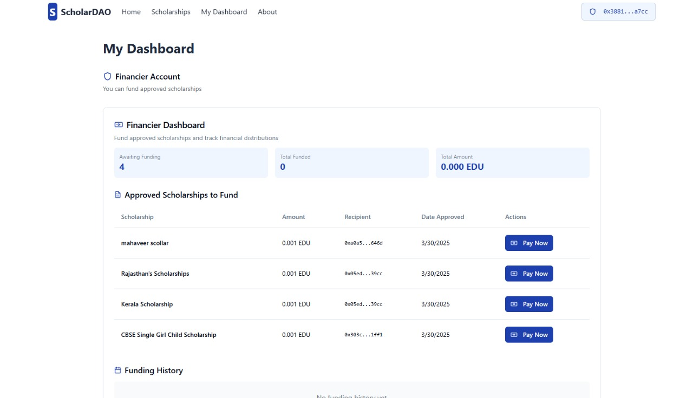

# ScholarDao

Claiming government scholarships is a complicated process involving manual steps for applying, verifying, and releasing funds. This can take anywhere from 15 to 30 days or even longer. Our project aims to bring transparency to the scholarship program by allowing applicants and officers to track the live status of applications and access various scholarship programs on a single platform. This makes the process easier for everyone.

Students are required to upload their documents, which will be verified through a multifactor authentication system, including video and photo verification. To ensure security and privacy, we are using Zero-Knowledge Proof (ZK-Poof) technology for document verification. This allows the system to verify the documents without revealing any personal details, ensuring full confidentiality.

For transactions, we are integrating EduChain, a blockchain-based system, which will handle the transfer of funds securely and transparently. Using EduChain, all transactions related to scholarship funds will be traceable, providing real-time updates to applicants and officers. This blockchain integration ensures that every transaction is recorded on a decentralized ledger, making the entire process tamper-proof and more trustworthy.
## Screenshots And Live Link

Live Link: https://acehack-scholardao.vercel.app/

<table>
  <tr>
    <td></td>
    <td align="right"></td>
  </tr>
  <tr>
    <td></td>
    <td align="right"></td>
  </tr>
  <tr>
    <td colspan="2" align="center"></td>
  </tr>
</table>


## Instruction

Kindly follow the following Instructions to run the project in your system and install the necessary requirements
## Run Locally

Clone the project

```bash
  git clone https://github.com/kartikmehta18/ScholarDao.git
```

Go to the project directory

```bash
  cd ScholarDao
```

Install dependencies

```bash
  npm install
```

Start the server

```bash
  npm run start
```


## Environment Variables

To run this project, you will need to add the following environment variables to your .env file

`VITE_SUPABASE_URL=`

`VITE_SUPABASE_ANON_KEY=`


## Documentation

[Anon Aadhaar](https://documentation.anon-aadhaar.pse.dev/docs/intro)

[EduChain](https://devdocs.opencampus.xyz/)


## Tech Stack

**Client:** React, TailwindCSS , Shadcn, Educhain 

**Server:**  Supabase ,  Solidity ,Anon Aadhaar


## License

[MIT](https://choosealicense.com/licenses/mit/)


## Features

- Light/dark mode toggle
- Live previews
- Fullscreen mode
- Cross platform

